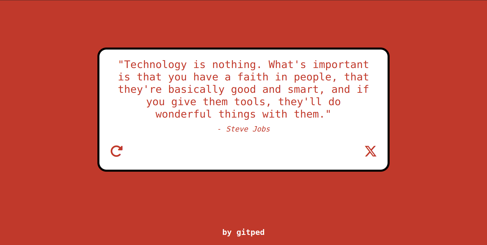

# Random Quote Generator
A simple React web app to fetch and display random quotes from Quotable, an open source quotations API (https://api.quotable.io/random), and allow users to tweet their favorite ones.

## Notable Implementations
- **API Integration:** A refresh button to fetch data from an external API (Quotable) and update the UI accordingly.
- **Tweet Functionality:** A tweet button that allows users to share quotes directly on their Twitter profile.
- **Dynamic Styling:** Background and text color change with each new quote, providing a fresh and engaging user interface.
- **Unit Testing:** A basic unit test to test for proper rendering.
