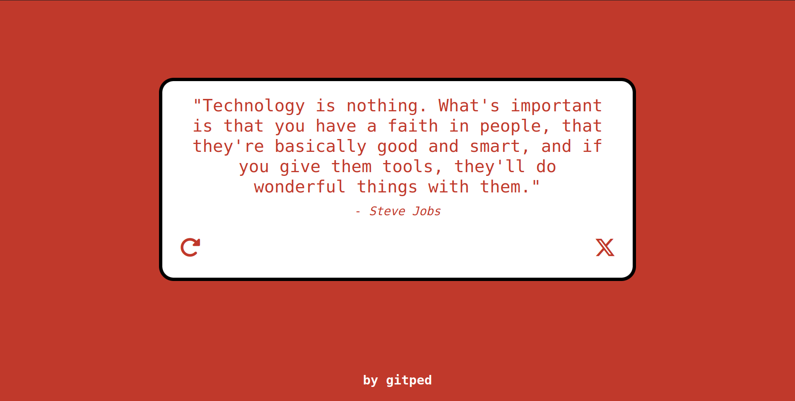

# Random Quote Generator
A simple React web app that generates random quotes and allows users to tweet their favorite ones.

## Notable Implementations
- **API Integration:** A refresh button to fetch data from an external API (Quotable) and update the UI accordingly.
- **Tweet Functionality:** A tweet button that allows users to share quotes directly on their Twitter profile.
- **Dynamic Styling:** Background and text color change with each new quote, providing a fresh and engaging user interface.
- **Unit Testing:** A simple test to check whether the components render without crashing.
- 